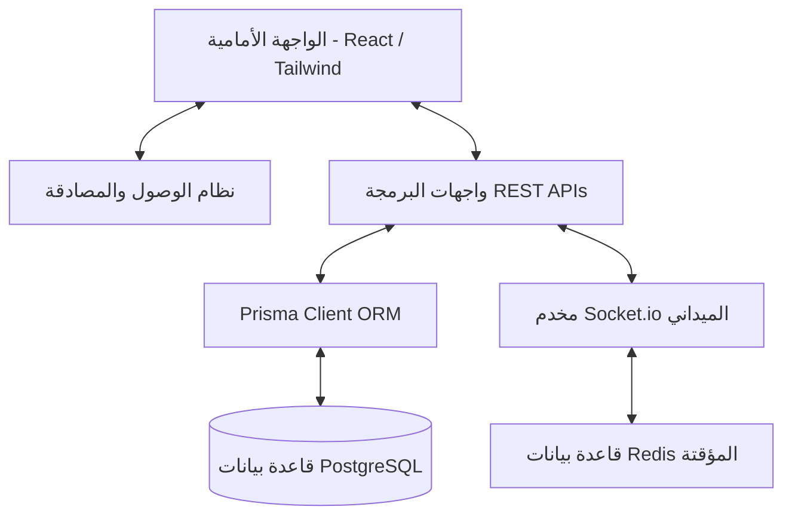

# معمارية النظام وهيكلية المنظومة الانتخابية

تحتوي هذه الوثيقة على تفصيل المعمارية التقنية والهيكل العام للماكينة الانتخابية في محافظة ذي قار.

---

## 1. المعمارية العامة (High-Level Architecture)

تعتمد المنظومة على معمارية **Next.js App Router** المتكاملة (Fullstack) حيث يتم الدمج بين الواجهات الأمامية والخدمات الخلفية (API Routes) بشكل متناسق مع الاتصال بقاعدة بيانات **PostgreSQL** مركزية عبر وسيط **Prisma ORM**.

---

## 2. الأنظمة المترابطة الـ 14 (Integrated Systems)

تم دمج 14 نظاماً فرعياً لتمثيل غرفة عمليات متكاملة لإدارة العملية الميدانية والتنظيمية:

1. **لوحة التحكم المركزية (Executive Dashboard)**: تعرض المؤشرات الحاسمة والتقديرات الاستراتيجية لحظياً.
2. **تسجيل الناخبين (Voter Registration)**: نظام استقطاب وإدخال بيانات الناخبين جغرافياً وعشائرياً مع التدقيق البيومتري وإحداثيات الموقع (GPS).
3. **بيانات المفوضية الرسمية (Commission Data)**: مطابقة وإدخال كشوفات المفوضية العليا المستقلة للانتخابات (IHEC).
4. **إدارة المفاتيح الانتخابية (Electoral Keys)**: إدارة قادة الحملة الميدانيين وتقييم فعاليتهم.
5. **إدارة العشائر والكتل المجتمعية (Tribal Management)**: تحليل النفوذ العشائري والعلاقات الشجرية.
6. **نظام الخدمات والمساعدات (Services Management)**: متابعة الطلبات المقدمة من المواطنين وتحليل العائد الانتخابي لها (ROI).
7. **تتبع المهام والزيارات الميدانية (Task Tracking)**: إسناد وتوجيه المندوبين وتحديث حالات الزيارات.
8. **إدارة الكوادر والمتطوعين (Volunteers Management)**: تنظيم المندوبين والمشرفين على محطات الاقتراع.
9. **محرك الاتصالات السياسية (Political Comms Engine)**: حملات التوعية وبناء شبكات التأييد.
10. **بث الرسائل القصيرة والتواصل (SMS Broadcasting)**: إرسال الرسائل عبر القوالب الديناميكية للمؤيدين.
11. **نظام الرأي العام والنبض المحلي (Public Opinion)**: رصد المزاج الشعبي العام والقضايا الانتخابية الساخنة.
12. **نظام المنافسين والخصوم (Competitors Management)**: تتبع تحركات القوائم الأخرى ووضع الخطط المضادة.
13. **تحليل البيانات الشامل والإنذار المبكر (Data Analysis & Early Warning)**: رصد التهديدات في المناطق الانتخابية المتأرجحة.
14. **غرفة عمليات يوم الحسم (War Room)**: متابعة نسب الاقتراع وتأكيد حضور الناخبين والفرز النهائي لحظة بلحظة.

---

## 3. تدفق البيانات (Data Flow)

1. **جمع البيانات**: يقوم المندوب الميداني بإدخال بيانات الناخب مع إحداثيات موقعه عبر الجوال.
2. **المعايرة والمطابقة**: يطابق النظام البيانات تلقائياً مع سجل المفوضية لتحديد حالة الناخب (Registry Verified).
3. **حساب المؤشرات**: يمرر محرك المؤشرات الذكي (`indicators-engine.ts`) البيانات لحساب مؤشرات القوة مثل:
   - **EII** (Electoral Influence Index)
   - **KRI** (Key Reliability Index)
   - **DRS** (Dropout Risk Score)
4. **العرض**: تظهر الإحصاءات والرسومات البيانية تفاعلياً في لوحة تحكم الإدارة لاتخاذ القرارات الاستراتيجية.
